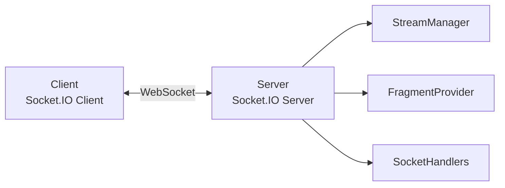
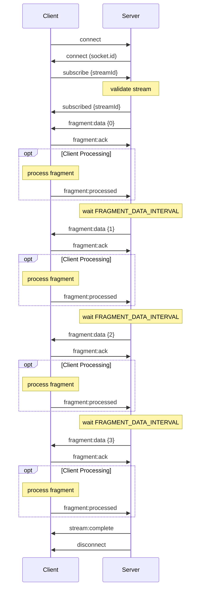
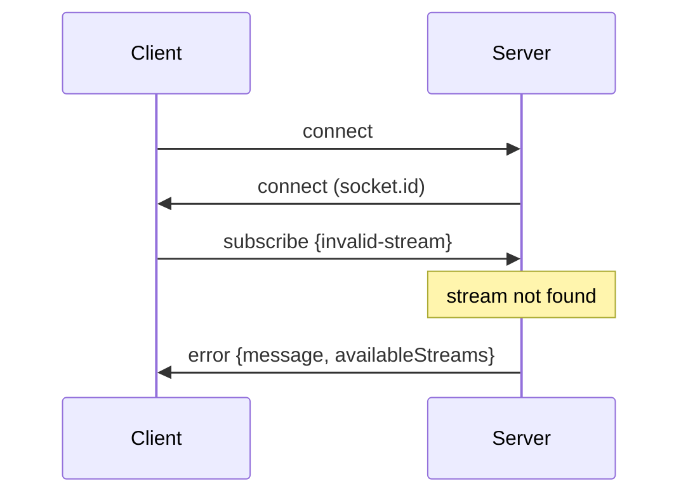
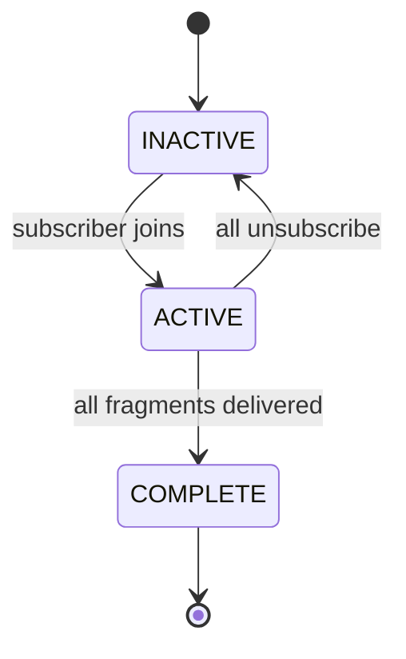

# Mock Media Service Protocol Specification

## Overview

The Mock Media Service implements a bidirectional WebSocket protocol for real-time audio fragment streaming. It uses Socket.IO as the transport layer and delivers binary m4s audio fragments with metadata.

**Protocol Version:** 1.0  
**Transport:** Socket.IO over WebSocket  
**Default Endpoint:** `ws://localhost:4000`

## Architecture



## Connection

### Establish Connection

**Connection Flow:**
1. Client initiates WebSocket connection to `ws://localhost:4000`
2. Server responds with `connect` event
3. Server assigns unique socket ID
4. Socket ready to accept subscriptions

### Socket.IO Configuration

- **Max buffer size:** 10MB (configurable via `maxHttpBufferSize`)
- **CORS:** Enabled for all origins (development setting)
- **Transport:** WebSocket preferred
- **Reconnection:** Supported

## Message Types

### Client → Server Events

#### 1. `subscribe`
Subscribe to a specific audio stream.

**Payload:**
```typescript
{
  streamId: string  // Stream identifier (e.g., "test-stream")
}
```

**Response:** `subscribed` event on success, `error` event on failure

---

#### 2. `unsubscribe`
Unsubscribe from a stream.

**Payload:**
```typescript
{
  streamId: string  // Stream to unsubscribe from
}
```

**Response:** `unsubscribed` event

---

#### 3. `fragment:ack`
Acknowledge receipt of a fragment (optional but recommended).

**Payload:**
```typescript
{
  fragmentId: string  // Unique fragment identifier (e.g., "test-stream-0")
}
```

**Response:** None (tracked internally)

---

#### 4. `fragment:processed`
Send a processed audio fragment back to the server (optional).

**Payload:**
```typescript
{
  fragment: AudioFragment;  // Original fragment metadata from server
  data: Buffer;             // Processed audio data
}
```

**Response:** None (logged for tracking/debugging)

**Use Case:**
- Client processes received fragment (e.g., transcoding, filtering, analysis)
- Client sends processed result back to server with same structure as `fragment:data`
- Server logs receipt for monitoring and debugging
- Enables bidirectional audio processing workflows

---

#### 5. `stream:remux`
Trigger server-side remux: replace the original audio in the source video with the processed audio fragments saved in output.

**Payload:**
```typescript
{
  streamId: string  // Stream identifier (maps to videos/{streamId}.mp4)
}
```

**Response:** `stream:remux:complete` on success, `error` on failure

---

#### 6. `output:clean`
Delete processed audio fragments from the output directory.

**Payload:**
```typescript
{
  streamId?: string  // Optional: when provided, clean only this stream's output
}
```

**Response:** `output:clean:complete` with list of removed directories

---

### Server → Client Events

#### 1. `subscribed`
Confirms successful subscription.

**Payload:**
```typescript
{
  streamId: string  // Subscribed stream ID
}
```

---

#### 2. `fragment:data`
Delivers an audio fragment with metadata and binary data.

**Payload:**
```typescript
{
  fragment: {
    id: string;              // Unique fragment ID (e.g., "stream-1-0")
    streamId: string;        // Stream identifier
    sequenceNumber: number;  // Fragment sequence (0-based)
    timestamp: number;       // Unix timestamp (ms)
    duration: number;        // Fragment duration (ms)
    codec: string;           // Audio codec (e.g., "aac")
    sampleRate: number;      // Sample rate (Hz, e.g., 44100)
    channels: number;        // Number of channels (1 = mono, 2 = stereo)
    metadata?: {             // Optional metadata
      fileName: string;      // Original file name
      fileSize: number;      // File size in bytes
      [key: string]: any;    // Additional metadata
    }
  },
  data: Buffer  // Binary m4s audio data
}
```

---

#### 3. `stream:complete`
Indicates all fragments have been delivered for a stream.

**Payload:**
```typescript
{
  streamId: string  // Completed stream ID
}
```

**Behavior:**
- Sent after the final fragment (default: 4 fragments)
- Server disconnects the socket immediately after this event
- All stream resources are cleaned up

---

#### 4. `error`
Reports errors during operations.

**Payload:**
```typescript
{
  message: string;              // Error description
  streamId?: string;            // Related stream ID (if applicable)
  availableStreams?: string[];  // List of available streams (for "not found" errors)
  error?: string;               // Detailed error information
}
```

**Common Error Types:**
- Stream not found
- Invalid stream ID
- Subscription failure
- Internal server error

---

#### 5. `unsubscribed`
Confirms unsubscription from a stream.

**Payload:**
```typescript
{
  streamId: string  // Unsubscribed stream ID
}
```

---

#### 6. `disconnect`
Socket connection closed.

**Parameters:**
```typescript
reason: string  // Disconnect reason
```

**Common Reasons:**
- `"io server disconnect"` - Server-initiated (after stream completion)
- `"transport close"` - Network disconnection
- `"client namespace disconnect"` - Client initiated

## Protocol Flow

### Standard Flow (Happy Path)



### Error Flow (Stream Not Found)



## Stream Lifecycle

### Stream States



- **INACTIVE**: No subscribers, stream not running
- **ACTIVE**: Has subscribers, delivering fragments
- **COMPLETE**: All fragments delivered, auto-disconnect

### Fragment Delivery

**Configuration (via .env):**
- `FRAGMENT_DATA_INTERVAL`: Time between fragments (default: 15000ms)
- `MAX_FRAGMENTS_PER_STREAM`: Total fragments to deliver (default: 4)
- `ACK_TIMEOUT_MS`: Timeout for acknowledgment (default: 5000ms)
- `MAX_RETRIES`: Max retry attempts for failed deliveries (default: 3)

**Delivery Behavior:**
1. Server loads m4s files from `audio-fragments/{streamId}/`
2. Fragments sent at `FRAGMENT_DATA_INTERVAL`
3. Each fragment broadcast to all subscribers simultaneously
4. After `MAX_FRAGMENTS_PER_STREAM`, stream marks as complete
5. Server sends `stream:complete` event
6. Server disconnects all subscribers

### Acknowledgment Mechanism

**Optional but recommended:**
- Client sends `fragment:ack` after receiving fragment
- Server tracks pending acknowledgments with timeout
- If no ack within `ACK_TIMEOUT_MS`, counts as retry
- After `MAX_RETRIES`, server logs warning but continues
- Purpose: Reliability tracking, performance monitoring, debugging

### Processed Fragment Upload

**Optional feature for bidirectional workflows:**
- Client can send `fragment:processed` to upload processed audio back to server
- Useful for workflows like transcoding, audio filtering, or analysis results
- Server logs receipt for monitoring and debugging purposes
- Does not affect fragment delivery flow or stream lifecycle

## REST API Endpoints

### Health Check
`GET http://localhost:4000/`

**Response:**
```json
{
  "message": "Mock Media Service",
  "status": "running",
  "stats": {
    "activeStreams": 1,
    "totalSubscribers": 2
  }
}
```

### List Available Streams
`GET http://localhost:4000/streams`

**Response:**
```json
{
  "streams": ["test-stream", "stream-1", "my-stream"]
}
```

## Error Handling

### Client-Side
**Events to handle:**
- `connect_error` - Connection failed
- `error` - Protocol/stream errors
- `disconnect` - Unexpected disconnects (check `reason` parameter)

### Server-Side
The server handles errors gracefully:
- Invalid stream ID → `error` event with available streams
- Missing parameters → `error` event with validation message
- Internal errors → `error` event with generic message
- Stream not found → `error` event before subscription fails

## Configuration Reference

### Environment Variables

| Variable | Type | Default | Description |
|----------|------|---------|-------------|
| `HOST` | string | `localhost` | Server bind address |
| `PORT` | number | `4000` | Server port |
| `FRAGMENT_DATA_INTERVAL` | number | `15000` | Milliseconds between fragments |
| `ACK_TIMEOUT_MS` | number | `5000` | Acknowledgment timeout (ms) |
| `MAX_RETRIES` | number | `3` | Max retry attempts |
| `MAX_FRAGMENTS_PER_STREAM` | number | `4` | Fragments before auto-disconnect |
| `ASSETS_PATH` | string | `(auto)` | Custom path to audio fragments |

### Timing Characteristics

**Default timing:**
- Initial connection: < 100ms
- Subscribe latency: < 50ms
- First fragment: < 100ms after subscription
- Inter-fragment delay: 15000ms (configurable)
- Stream completion: After 4 fragments (configurable)
- Auto-disconnect: Immediate after `stream:complete`

## Security Considerations

**Current implementation (development):**
- CORS enabled for all origins (`*`)
- No authentication required
- No encryption (plain WebSocket)

**Production recommendations:**
- Implement authentication (token-based)
- Restrict CORS to specific origins
- Use WSS (WebSocket Secure) with TLS
- Add rate limiting
- Implement access control per stream

## Limitations

- **Fixed fragment count**: Always delivers exactly `MAX_FRAGMENTS_PER_STREAM` (default: 4)
- **Auto-disconnect**: Server forcibly disconnects after stream completion
- **No seek/rewind**: Fragments delivered sequentially only
- **No pause/resume**: Stream cannot be paused once started
- **Single pass**: Each subscription delivers fragments once
- **No multi-stream**: One stream per socket connection at a time

## Troubleshooting

### Common Issues

**"Stream not found"**
- Verify stream directory exists: `src/assets/audio-fragments/{streamId}/`
- Check available streams: `GET http://localhost:4000/streams`
- Ensure .m4s files exist in stream directory

**"Connection refused"**
- Check server is running: `curl http://localhost:4000/`
- Verify port is correct (default: 4000)
- Check firewall settings

**"No fragments received"**
- Check server logs for errors
- Verify subscription succeeded (`subscribed` event received)
- Check .m4s files are readable

**"Irregular timing"**
- Server under load
- Network latency
- Check `FRAGMENT_DATA_INTERVAL` configuration

## Version History

- **v1.2** (2025-10-23): Added `stream:remux` and `output:clean` events and corresponding completions
- **v1.1** (2025-10-23): Added `fragment:processed` event for bidirectional audio workflows
- **v1.0** (2025-10-23): Initial protocol specification

## References

- [Socket.IO Client API](https://socket.io/docs/v4/client-api/)
- [Socket.IO Server API](https://socket.io/docs/v4/server-api/)
- [MPEG-4 Part 14 (m4s format)](https://en.wikipedia.org/wiki/MPEG-4_Part_14)

